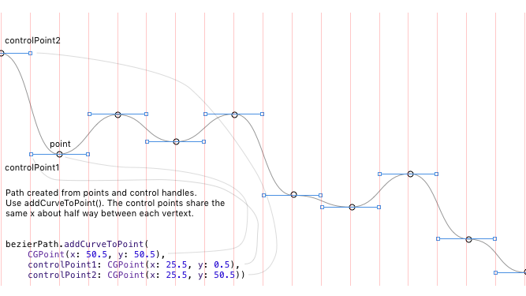

# Bezier-Landscape

This is a proof of concept showing a system for creating an endless physics landscape for games similar to 
[Tiny Wings](http://www.andreasilliger.com), [Alto's Adventure](http://altosadventure.com), or others.

This example uses two "landscape" sections that leap frog each other connecting to the previous section on the right. 
A camera node follows the ball as it rolls down the hill, while landscape sections are static. As a landscape section 
moves out of the camera's view on the left it is moved to the right side and a new landscape contour is created. 

The width of each landscape section is set by *sectionWidth*. The current example sets this to 10000 points. Landscape 
contours are drawn using addCurveToPoint(), see the notes below for more info on this. 

The physics body uses a UIBezier path as an edge chain. The number of 
curves in a section is set by *steps*, the current example uses 80. 

*NOTE!*:

    skView.showsPhysics = true

Causes a memory leak! While using this for testing you may see an increasing use of memory. Turn this off and memory useage
should drop to reasonable levels.  

This images gives an idea of how addCurveToPoint() is used in this example. Points are spaced evenly on the X. On the Y the value is set to a random value. The control points are set to Y of their attached point, and the X value is set to mid point betwen the current point and the previous point. 

 
